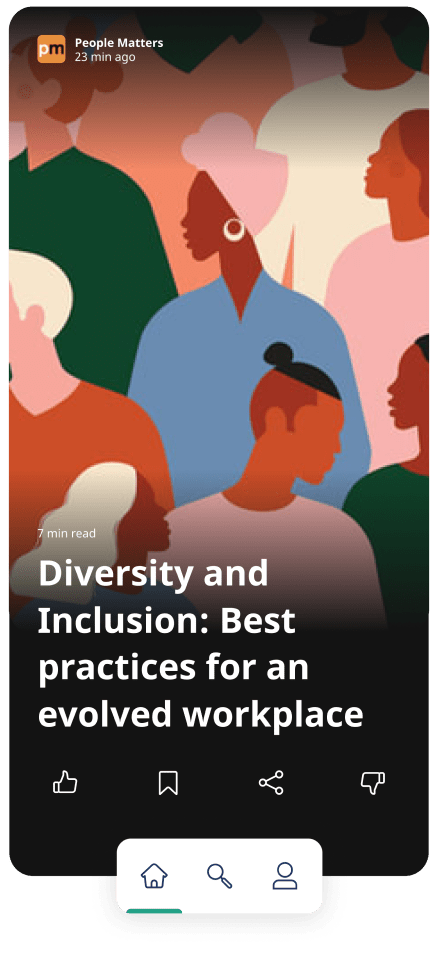

# Xayn Discovery

[](./LICENSE)

<p align="center">
    
</p>
<br/>
<p align="center">
    <a href="https://apps.apple.com/us/app/id1605873072">  </a>  
    <a href="https://play.google.com/store/apps/details?id=com.xayn.discovery" target="_blank"> </a>
</p>
<br/>

 

[Xayn Discovery](https://beta.xayn.com/) is your news assistant that discovers an endless stream of
news, articles and other content for you. Ad-free, loaded with privacy features and highly
personalised.

<br/>

**Endless content**<br/>Discover a stream of continuous reading recommendations that you will love.
News, articles and other content from great sources are just one scroll away.

**Full on privacy**<br/>Everything you do and read with Xayn stays on your device. We’ve also made
our product completely ad-free, so that you can't be retargeted by anyone. On top of that, we block
cookies & third-party trackers, so that you stay completely anonymous.

**Your personalised news assistant**<br/>Our powerful edge AI learns all about your interests and
searches the internet for content recommendations you will love. Powered by great content sources
from around the world and individually curated for you.

<br/>

## Component overview :gear:

You can check more details about the code structure we
follow [here](./application#component-overview-%EF%B8%8F).

###   

[top :arrow_heading_up:](#xayn-discovery)

## Analytics :chart_with_upwards_trend:

Our understanding of a privacy-friendly discovery app is that, as a rule, we do not process any of
the _personal_ data you input in the App. The data within the App is deleted once you delete the App
from your device. For the sake of undertanding user behavior, we track certain user actions
anonymously. For full transparency, you can check an
up-to-date [list of tracked events and properties](./application#analytics-) that shouldn't violate
your privacy that is sent to the analytics platforms we utilize.

[top :arrow_heading_up:](#xayn-discovery)

## How to run :hammer_and_wrench:

### Locally

1. Fork the repository.
2. To be able to run locally, you'll need to add an environment file `.env.debug` and `.end.pod`
   to [`application`](application)
   directory. An example of what to include in these files can be found
   in [`env.example`](application/.env.example).
3. Provide your own keys and URLs to the newly created `.env.debug` and `.end.pod`. Alternatively,
   you can use our [fastlane configuration](#fastlane) to automatically fill the secrets by
   answering some wizard questions in the command line, just run on your
   terminal: `$ fastlane build_runner`.
4. In case you chose to run `$ fastlane build_runner`, you can skip this step. Run on your terminal

```shell
$ cd application
$ flutter pub get
$ flutter pub run build_runner build --delete-conflicting-outputs
```

5. Run the app during the development on simulators/emulators by simply executing on the
   terminal: `$ flutter run`.

### Real iOS device

In order to run and debug the app on a real iOS device a provisioning profile and a developer
certificate is necessary. A default development profile for development is part of this repository,
to install it run:

```shell 
$ open ios/profiles/Xayn_Discovery_Internal_Develop_Profile.mobileprovision
```

Or open the profile in the finder, then install the development certificate found
under `ios/profiles/Certificates-internal.p12` the encryption key can be found in 1password.

If you want to use another profile follow this steps:

1. Create a development certificate in XCode (Settings -> Accounts -> Xayn AG Team -> Manage
   Certificates -> "+" Button -> Apple Development)
2. Create a "iOS App Development" provisioning profile
   under [Certificates, Identifiers & Profiles](https://developer.apple.com/account/resources/profiles/list)
3. Be sure that it matches the default team id and app id found in `ios/fastlane/Appfile` and that
   it contains your created certificate in step 1
4. Edit the `ios/Flutter/UserDefaults.xcconfig` to contain

```properties
USER_PROVISIONING_PROFILE=YOUR PROFILE NAME
USER_CERTIFICATE=YOUR CERTIFICATE NAME 
```

5. Now plugin your iOS device (be sure it is accepted as a development device XCode -> Window ->
   Devices )
6. Run `flutter run`

_NOTE: The `ios/Flutter/Dartdefines.xcconfig` can contain overrides
for `USER_PROVISIONING_PROFILE/ CERTIFICATE` (when running `fastlane publish`) so be sure that this
is not the case!!!_

[top :arrow_heading_up:](#xayn-discovery)

## Dependencies :package:

### Code dependencies

Read more about the dependencies we use in **Xayn Discovery** [here](./application#dependencies-).

### Build dependencies

#### fastlane

[fastlane](https://docs.fastlane.tools/) makes it easy to automate beta deployments and releases for
your iOS and Android apps.

First, check
fastlane's [get started section](https://docs.fastlane.tools/getting-started/ios/setup/) in the
documentation to make sure you setup it locally.

We have [custom fastlane scripts](application/fastlane) that you can run locally to make your life
easier:

- `$ fastlane build_runner` ensures that all dependencies are created, and property files are
  correctly set-up.
- `$ fastlane check` setup all dependencies then checks if the code if properly formatted, no dart
  analysis issues, and all tests are passing.

#### Gitleaks

[Gitleaks](https://github.com/zricethezav/gitleaks) is a tool for detecting and preventing hardcoded
secrets in git repos. The tool scans the repo using a set of regex rules. We have our custom set of
rules implemented in the [`.gitleaks.toml`](.gitleaks.toml) file, located at the root folder of the
project.

Steps to follow for scanning the repo:

- [Get started](https://github.com/zricethezav/gitleaks#getting-started) with gitleaks
- Navigate to the [`root folder`](.) of the project.
- Run the terminal command `$ gitleaks detect -l debug --verbose`. For more information about the
  usage, please check [Gitleaks documentation](https://github.com/zricethezav/gitleaks#usage). _
  Please note: in order to use our custom set of rules, the location where the command is run must
  be the same of where the `.gitleaks.toml` is located. _
- Check the output on the terminal and look for any hardcoded secrets.

[top :arrow_heading_up:](#xayn-discovery)

## License :scroll:

This project is licensed under the `Apache License 2.0`. See the [LICENSE](./LICENSE) file for
details.

[top :arrow_heading_up:](#xayn-discovery)

----------
