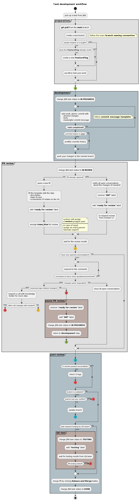

## Task development workflow

This doc contains main moments of the workflow we follow during development a task at Xayn.

Some references from this doc:

1. [Branch naming convention](./github_conventions.md#branch-naming)
1. [Commit message template](./github_conventions.md#commit-messages)

## The workflow itself 😀

--------

##### 🛠 To edit diagram:

1. copy script
   

     
plantuml diagram script

        @startuml
        title: Task development workflow
        start
        :pick up a task from JIRA;
        
        partition #e0e0e0 "**preparations**" {
          :**git pull** from the **main** branch ;
          :create a new branch;
            floating note right: follow the team **branch naming convention**
          if (simple feature or a bugfix?) then (no)
            if (does the **FeatureFlag** already exist?) then (no)
              :create a new **FeatureFlag**;
            else (yes)
            endif
            :use **it** to //hide// your work;
          else (yes) 
          endif
        }
        
        #8BC34A:(A)
        
        partition #b0bec5 "**development**" {
          :change JIRA task status to **IN PROGRESS**;
          repeat
            :add small, atomic commit with
             - desired changes
             - tests
             - meaningful commit message;
              floating note right: follow **commit message template**
          repeat while (<b> task completed?) is (no)
          if (commits history is __dirty__?) then (yes)
            :prettify commits history;
          else (no)
          endif
          :push your changes to the remote branch;
        }
        
        partition #e0e0e0 "**PR review**" {
          :change JIRA task status to **IN REVIEW**;
          if (PR already opened?) then (no)
            :open a new PR;
            :fill the template with the data
             - description
             - steps to test
             - screenshots (if relates to the UI);
            :add **"ready for review"** label;
            :asssign **team_blue** for review;
              note right 
                system will assign
                a --random-- propper peer
                ====
                in case of need, 
                assign an extra person 
                (domain expert)
              end note
          else (yes)
            :notify all open conversations 
             about the changes (if needed);
            :remove **"WIP"** label;
            :add **"ready for review"** label;
            :re-request review 
             from reviwer(-s);
          endif
        
          :wait for the review results;
        
          #ffca28:(C)
        
          if (have any opened conversations?) then (yes)
            repeat
              :respond to the comments;
            repeat while (reviewer(-s) have more questions/comments?) is (yes)
            if (changes were requested?) then (yes)
              if (business-logic-related changes?) then (yes)
                :request a call with knowladge 
                 holder for more data;
                if (after call changes still needed?) then (yes)
                  #FF5252:(B)
                  detach
                else (no)
                  #ffca28:(C)
                  detach
                endif
              else (no)
                #FF5252:(B)
                partition #bcaaa4 "**pause PR review**" {
                  :remove **"ready for review"** label;
                  :add **"WIP"** label;
                  :change JIRA task status to **IN PROGRESS**;
                  :return to **development** step;
                }
                #8BC34A:(A)
                detach
              endif
            else (no)
              :close all open conversations;
            endif
          else (no)
          endif
        }
        
        partition #b0bec5 "**post review**" {
          #26c6da:(D)
          if (CI checks passed successfylly?) then (no)
            :check CI logs;
            #FF5252:(B)
            detach
          else (yes)
          endif
          if (branch is outdated?) then (yes)
            if (branch has any conflict?) then (yes)
              #FF5252:(B)
              detach
            else (no)
            endif
            :update branch;
            #26c6da:(D)
            detach
          else (no)
          endif
        
          if (task requires testing by QA team?) then (yes)
          partition #bcaaa4 "**QA test**" {
            :change JIRA task status to **TESTING**;
            :add **"testing"** label;
            :wait for testing results from QA team;
            if (PR testing failed?) then (yes)
              #FF5252:(B)
              detach
            else (no)
            endif
          }
          else (no)
          endif
          :merge PR by clicking **Rebase and Merge** button;
          :change JIRA task status to **DONE**;
        }
        
        stop
        @enduml
   

1. edit it at [here](https://plantuml.com/)
1. generate a new `.png` image and update it here
1. do not forget to copy new `plantuml diagram script` here as well